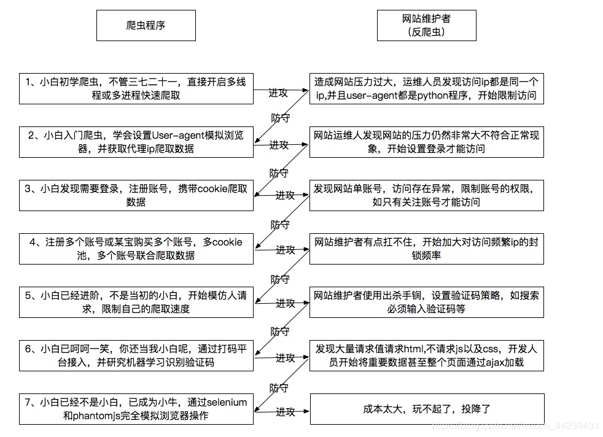

# 学习笔记（第二周）

- [学习笔记（第二周）](#学习笔记第二周)
  - [使用 PyMySQL 连接 MySQL](#使用-pymysql-连接-mysql)
    - [游标（Cursor）](#游标cursor)
  - [爬虫、反爬虫、反「反爬虫」](#爬虫反爬虫反反爬虫)
    - [绕过反爬虫第一招：模拟浏览器正常请求](#绕过反爬虫第一招模拟浏览器正常请求)
      - [修改 User-Agent 请求头（HTTP Request Header）](#修改-user-agent-请求头http-request-header)
      - [修改其它请求头](#修改其它请求头)
    - [绕过反爬虫第二招：给爬虫添加 Cookies](#绕过反爬虫第二招给爬虫添加-cookies)
      - [通过 requests 的 `Session()` 方法获取 Cookies](#通过-requests-的-session-方法获取-cookies)
      - [通过 WebDriver 自动登录并获取 Cookies](#通过-webdriver-自动登录并获取-cookies)
    - [绕过反爬虫第三招：自动识别验证码](#绕过反爬虫第三招自动识别验证码)
      - [1. 下载验证码图片](#1-下载验证码图片)
      - [2. 把彩色图片转换成灰度图片](#2-把彩色图片转换成灰度图片)
      - [3. 把灰度图片二值化](#3-把灰度图片二值化)
      - [4. 图片 OCR](#4-图片-ocr)
    - [绕过反爬虫第四招：给 Scrapy 爬虫添加代理 IP](#绕过反爬虫第四招给-scrapy-爬虫添加代理-ip)
      - [1. 修改 `settings.py`](#1-修改-settingspy)
        - [获取免费的代理 IP](#获取免费的代理-ip)
      - [2. 修改 `middlewares.py`](#2-修改-middlewarespy)
      - [3. 修改爬虫逻辑 `spiders/httpbin.py`](#3-修改爬虫逻辑-spidershttpbinpy)
      - [运行爬虫](#运行爬虫)

## 使用 PyMySQL 连接 MySQL

在 Python 3.7 以及更高的版本中，相比其它的 MySQL 连接器，PyMySQL 更稳定。

```bash
python3 -m pip install pymysql
```

```py
import pymysql

# 建立数据库连接
db = pymysql.connect(
    host='localhost',
    user='root',
    password='root_123',
    port=3306
)

# 获取游标
cursor = db.cursor()

# 在游标中执行 SQL 语句
cursor.execute('select version();')

# 获取第一条执行结果
db_version = cursor.fetchone()
print('MySQL version: ', db_version)

# 在游标中执行其它语句
# cursor.execute('create database test2 character set utf8mb4;')
# cursor.execute('show create database test2;')
# db_info = cursor.fetchone()
# print('Show DB create info: ', db_info)

# 关闭游标
cursor.close()

# 关闭数据库连接
db.close()
```

运行上面的代码，结果如下：

```bash
$ python3 pymysql_demo.py
MySQL version:  ('8.0.19',)

# 注意：fetchone() 的返回值是一个元组。
```

### 游标（Cursor）

游标（Cursor）是系统为用户开设的一个**数据缓冲区**，存放 SQL 语句的执行结果。每个游标区都有一个名字，用户可以用 SQL 语句逐一从游标中获取记录，赋值给主变量，然后交给主语言进一步处理。

> 关系数据库中的操作会对整个行集起作用。例如，由 `SELECT` 语句返回的行集，包括满足该语句的 `WHERE` 子句中条件的所有行。这种由语句返回的完整行集称为「结果集」。应用程序，特别是交互式联机应用程序，并不总能将整个结果集作为一个单元来有效地处理。这些应用程序需要一种机制，以便每次处理一行或一部分行。「游标」就是提供这种机制的（对结果集的）一种扩展。
>
> 游标通过以下方式来扩展结果处理：
>
> - 允许定位在结果集的特定行。
> - 从结果集的当前位置检索一行或一部分行。
> - 支持对结果集中当前位置的行进行数据修改。
> - 如果其他用户对显示在结果集中的数据库数据做出了更改，则提供不同级别的可见性支持。
>
> from <https://docs.microsoft.com/zh-cn/sql/relational-databases/cursors?view=sql-server-ver15>

## 爬虫、反爬虫、反「反爬虫」

爬虫与反爬虫是一对孪生兄弟，彼此之间联系紧密，想要学好爬虫，必须了解反爬虫技术，并在此基础上破解反爬虫技术设置的障碍，这个过程可以叫做「反反爬虫」，读起来有点儿拗口，但理解起来不难。

下面是一张爬虫与反爬虫的攻防示意图，看完之后有一种「道高一尺、魔高一丈」的感觉，自然而然就想起了一句话：**进攻总是比防守容易**。



### 绕过反爬虫第一招：模拟浏览器正常请求

#### 修改 User-Agent 请求头（HTTP Request Header）

使用 [fake-useragent 库](https://github.com/hellysmile/fake-useragent) 可以随机生成 User-Agent。

```py
# python3 -m pip install fake-useragent

from fake_useragent import UserAgent

# 添加 verify_ssl=False 参数可以加快 UA 数据的下载速度，提升下载成功率
ua = UserAgent(verify_ssl=False)

print(f'Chrome UA: {ua.chrome}')
print(f'Firefox UA: {ua.ff}')
print(f'Random UA: {ua.random}')
```

#### 修改其它请求头

- Referer
- Host
- ...

对于模拟请求头，有同学提问：

> 请求头中有很多信息，需要一个个加进去试吗？

助教老师回复：

> 要模拟浏览器，就是说请求头越接近浏览器越好，所以你**最好和浏览器都保持一样，都复制过来**。

### 绕过反爬虫第二招：给爬虫添加 Cookies

#### 通过 requests 的 `Session()` 方法获取 Cookies

```py
# 待补充
```

#### 通过 WebDriver 自动登录并获取 Cookies

```py
# 待补充
```

### 绕过反爬虫第三招：自动识别验证码

为了应对爬虫，现如今的验证码可谓千姿百态，本周的课程主要讲述如何识别最普通的「字符」验证码（如下图所示）。


#### 1. 下载验证码图片

```py
import requests
from fake_useragent import UserAgent

ua = UserAgent(verify_ssl=False)
my_ua = ua.chrome

headers = {
    'user-agent': my_ua,
}

img_url = 'https://ss1.bdstatic.com/70cFuXSh_Q1YnxGkpoWK1HF6hhy/it/u=1320441599,4127074888&fm=26&gp=0.jpg'

r = requests.get(img_url, headers=headers)
print(r.status_code)

with open('./captcha.jpg', 'wb') as f:
    f.write(r.content)
```

#### 2. 把彩色图片转换成灰度图片

```py
# 待补充
```

#### 3. 把灰度图片二值化

所谓「二值化」，就是让「深色像素颜色更深，浅色像素颜色更浅」。

```py
# 待补充
```

#### 4. 图片 OCR

```py
# 待补充
```

### 绕过反爬虫第四招：给 Scrapy 爬虫添加代理 IP

爬虫使用单一 IP 容易被封禁，Scrapy 爬虫可以使用「代理 IP」解决这个问题。具体有两种实现方式：

- 使用操作系统的代理 IP
- 使用随机的代理 IP

操作系统的代理 IP 需要通过 `export http_proxy='ip:port'` 类似的命令来声明，对于我这种日常离不开代理软件的人来说，为了爬虫而频繁更改系统代理实在太麻烦，因此这种方式不适合我。

因此，我只能针对 Scrapy 配置「随机代理 IP」，关键步骤如下。

#### 1. 修改 `settings.py`

```py
USER_AGENT = 'httpbin_spider (+http://www.yourdomain.com)'

# 激活默认的、以及自定义的 Downloader Middleware
# 末尾的数字越小，对应的 middleware 优先级越高
#
DOWNLOADER_MIDDLEWARES = {
    'httpbin_spider.middlewares.HttpbinSpiderDownloaderMiddleware': 543,
    'httpbin_spider.middlewares.RandomHttpProxyMiddleware': 400,
}

# 添加代理 IP 列表
#
HTTP_PROXY_LIST = [
    'http://101.37.118.54:8888',
    'http://101.4.136.34:81',
    'http://1.255.48.197:8080',
]
```

对于代理 IP 列表，助教老师提到一点需要注意：

> 爬虫代码中请求的网页是 https 开头的，而在 `settings.py` 中写的代理列表中，所有代理全部都是 http 开头的，随机切换代理中间件是无法将 http 代理设置给 https 请求的。
>
> 同理，如果你爬取的页面是 http 开头的，`settings.py` 中写的代理列表就要加入 http 开头的代理。

换句话说，如果要爬取的 URL 是 `https://` 开头，那么代理 IP 就必须同样写成 `https://` 这种形式，这是 `middlewares.py` 中的 `RandomHttpProxyMiddleware` 类的实现方法所决定的。当然，代理服务器本身也必须支持 https 协议。

##### 获取免费的代理 IP

GitHub 上有很多提供免费代理的项目，经过试用，下面这一个使用简单，响应迅速。

> A list of free, public, forward proxy servers. UPDATED DAILY!
>
> <https://github.com/clarketm/proxy-list>

默认的输出是纯文本格式，可以直接复制粘贴到代码中。

```bash
# Retrieve 5 http proxies that support HTTPS.

$ curl 'http://pubproxy.com/api/proxy?format=txt&limit=5&type=http&https=true'
144.76.214.154:1080
82.200.233.4:3128
142.93.130.169:8118
136.243.47.220:3128
198.98.55.168:8080
```

还可以把输出改为 JSON 格式，以便查看更详细的信息。

```bash
# Use HTTPie instead of curl, for HTTPie supports JSON

http -b 'http://pubproxy.com/api/proxy?format=json&limit=1&type=http&https=true'
```

```json
{
    "count": 1,
    "data": [
        {
            "country": "US",
            "ip": "198.98.58.178",
            "ipPort": "198.98.58.178:8080",
            "last_checked": "2020-07-07 08:56:01",
            "port": "8080",
            "proxy_level": "anonymous",
            "speed": "11",
            "support": {
                "cookies": 1,
                "get": 1,
                "google": 0,
                "https": 1,
                "post": 1,
                "referer": 1,
                "user_agent": 1
            },
            "type": "http"
        }
    ]
}
```

#### 2. 修改 `middlewares.py`

```py
from scrapy import signals
from scrapy.downloadermiddlewares.httpproxy import HttpProxyMiddleware
from scrapy.exceptions import NotConfigured
from collections import defaultdict
from urllib.parse import urlparse
import random


class HttpbinSpiderSpiderMiddleware:
    # ...


# 创建一个使用随机代理 IP 的 Downloader Middleware
#
class RandomHttpProxyMiddleware(HttpProxyMiddleware):

    def __init__(self, auth_encoding='utf-8', proxy_list=None):
        self.proxies = defaultdict(list)
        for proxy in proxy_list:
            parse = urlparse(proxy)
            self.proxies[parse.scheme].append(proxy)

    @classmethod
    def from_crawler(cls, crawler):
        if not crawler.settings.get('HTTP_PROXY_LIST'):
            raise NotConfigured

        http_proxy_list = crawler.settings.get('HTTP_PROXY_LIST')
        auth_encoding = crawler.settings.get('HTTPPROXY_AUTH_ENCODING', 'utf-8')

        return cls(auth_encoding, http_proxy_list)

    def _set_proxy(self, request, scheme):
        proxy = random.choice(self.proxies[scheme])
        request.meta['proxy'] = proxy


class HttpbinSpiderDownloaderMiddleware:
    # ...
```

坦白说，在上面的代码中，自定义类 `RandomHttpProxyMiddleware` 的逻辑我还没能够完全搞清楚，目前只是囫囵吞枣的照抄一遍！

#### 3. 修改爬虫逻辑 `spiders/httpbin.py`

```py
import scrapy

class HttpbinSpider(scrapy.Spider):
    name = 'httpbin'
    allowed_domains = ['httpbin.org']
    start_urls = ['http://httpbin.org/ip']

    def parse(self, response):
        print(response.text)
```

#### 运行爬虫

第一次：

```bash
$ scrapy crawl httpbin --nolog
{
  "origin": "101.4.136.34"
}
```

第二次：

```bash
$ scrapy crawl httpbin --nolog
{
  "origin": "101.37.118.54"
}
```

第三次：

```bash
$ scrapy crawl httpbin --nolog
{
  "origin": "202.104.xxx.xxx, 1.255.48.197"
}
```

作为对比，如果我不使用代理 IP，返回结果如下：

```bash
$ http_proxy='' curl http://httpbin.org/ip
{
  "origin": "202.104.xxx.xxx"
}
```
